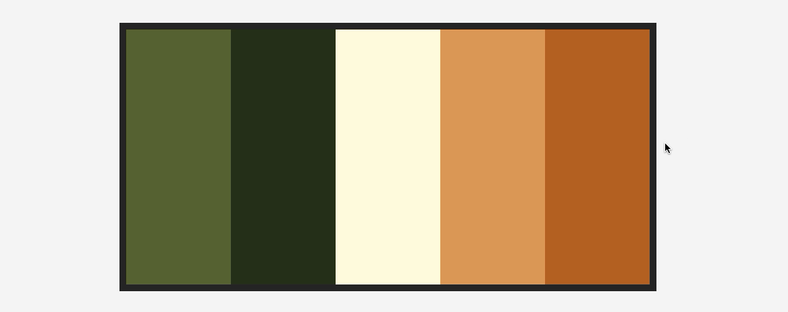
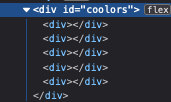

# Efeito Gavetas



## Como fazer o efeito de gavetas?

Eu resolvi criar esse repositório para ajudá-los, a entender alguns conceitos de javascript, e css, que em minha opinião são muito importantes e úteis.

Tive a ideia de recriar esse efeito de gavetas que vi em um site chamdo [coolors](https://coolors.co/palettes/trending). O site tem várias paletas de cores, que eu uso em meus projetos recomendo!

### Vamos começar:

Crie um arquivo html, css, e javascript, não esqueça de importar o JAVASCRIPT e CSS dentro html. No html vamos criar uma tag div com o __ID coolors__, que será onde injetamos as cores.

```html
    <body>
        <div id="coolors"></div>
    </body>
```

Agora no arquivo CSS, vamos remover alguns comportamentos do navegador, como _margin_ e _padding_. E no body do html, vamos centralizar tudo, e colocar uma cor de fundo, um background com uma cor whitesmoke(Branco claro).

```css
    * {
        margin: 0;
        padding: 0;
        box-sizing: border-box;
    }
    body {
        height: 100vh; /* Altura 100% */
        width: 100%;  /* Largura 100% */
        display: flex;
        justify-content: center;
        align-items: center;

        background-color: whitesmoke;
    }
```

E também precisamos estilizar a tag div que criamos. Para isso selecionamos a tag  __#collors__ e definimos uma largura e altura, um padding e uma cor de fundo. Agora vamos estilizar as gavetas são onde ficam cada umas das cores, para isso pegamos cada uma das divs __#coolors div__, e serão injetadas pelo javascript e definimos um padrão, como altura largura e mudamos o cursor do mouse. Note que se fizer isso sua página não mudará, pois não injetamos as divs com as cores.

```css
    #coolors {
        width: 400px;
        height: 200px;
        padding: 5px; /* Espaçamento interno */
        background-color: rgb(41, 41, 41); /* Cor de fundo */
        display: flex; /* Define o fluxo em linha (experimente apagar isso para ver!) */
    }

    #coolors div {
        width: 100%;
        height: 100%;
        cursor: pointer; /* Muda o cursor do mouse */
        transition: .2s; 
    }
```

É aqui onde a brincadeira realmente começa... Com todo o poder do javascript. __JAVASCRIPT GIVES YOU SUPER POWERS__. Vamos parar de enrolação e vamos codar!

Vamos criar uma variável estática onde ficará todas as cores de injeção. Caso você queira mudar as cores fique a vontade e divirta-se. O link das cores está [aqui](https://coolors.co/palettes/trending).

```javascript
    const allColors = [
        '#606c38', 
        '#283618', 
        '#fefae0', 
        '#dda15e', 
        '#bc6c25'
    ];
```

Precisamos pegar a div que criamos no html, para isso eu irei usar o querySelector() uma função interna do JS, e atribuí-lo a uma variável chamada $coolors. Uma boa prática é quando você usar variáveis que apontam para uma tag HTML usar um $ na frente. Pois facilita a leitura do seu código e futuras manutenções. E se você já usa __jQuery__ já sabe do que estou falando. 

```javascript 
    const $coolors = document.querySelector('#coolors');
```

A parte mais importante na minha opinião, é se você adicionar mais de 5 cores no array __allColors__ seu código não vai quebrar, pois ele conta o total do array, que no meu caso foi 5 itens, e faz um for por casa um deles. Agora para cada loop que ele faz ele injeta uma div dentro da teg.

```javascript
    allColors.forEach(() => {
        $coolors.innerHTML += '<div></div>';
    })
```

Infelizmente você ainda não vai ver diferença alguma. Mas se abrir o devTools do seu navegador favorito, eu espero que seja o FireFox. Então perceba que apareceu 5 divs lá dentro. Interessante, não?

<p align="center"> 
    
</p>

Agora vamos colorir cada uma dessas divs e é nessa hora que sua mente abre. Como é que se pega cada uma dessas divs, sem ter umas "trinta mil" linhas de código? Fácil se o querySelector() pega apenas o primeiro item que encontrar o querySelectorAll() pega todas, e salva em um array. E como eu mostrei agora pouco, podemos usar o __forEach()__ para interar em um arrey e colorir nossas divs.

```javascript
    // Pega todas as divs dentro da div#coolors e retorna um array com cada uma.
    const $allDivColors = document.querySelectorAll('#coolors div');

    // Faz um for por cada uma dessas divs
    // O element pega cada um dos elementos do array no caso, são div.
    // O index pega a posição do array 0, 1, 2...
    $allDivColors.forEach((element, index) => {
        // Agora atribuímos a cor para cada uma das divs
        element.style.backgroundColor = `${allColors[index]}`;

        // E adicionamos um evento de mouse de entrada
        element.addEventListener('mousemove', () => {
            element.style.width = '200%';
        })

        // E um evento de mouse de saída
        element.addEventListener('mouseout', () => {
            element.style.width = '100%';
        })
    })
```

Se você salvar e ver no seu navegador já vai estar funcionado 100%, talvez 99%. "Pois agora vem a parte que todo programador ama. Refatorar código"

<p align="center"> 
    
</p>
 
Calma, Calma! Não desista ainda só porque está tudo funcionando, vamos organizar essa bagunça. 
Primeiro vamos criar duas funções uma para cuidar da parte de renderizar e outra para colorir. E colocadas dentro de uma função auto executável __(() => {})()__.

```javascript
    (() => {
        function render() {
    
        }

        function color() {

        }
    })();
```

Agora vem a parte mais simples! Colocar o código dentro delas. Separada por sua respectiva função.

```javascript
    (() => {
    const allColors = [
        '#606c38', 
        '#283618',
        '#fefae0',
        '#dda15e',
        '#bc6c25'
    ];

    function render() {
        const $coolors = document.querySelector('#coolors');

        allColors.forEach(() => {
            $coolors.innerHTML += '<div></div>';
        })
    }

    function color() {
        const $allDivColors = document.querySelectorAll('#coolors div');

        $allDivColors.forEach((element, index) => {
            element.style.backgroundColor = `${allColors[index]}`;
            element.addEventListener('mousemove', () => {
                element.style.width = '200%';
            })
            element.addEventListener('mouseout', () => {
                element.style.width = '100%';
            })
        })
    }

    // Chamamos as funções
    render();
    color();
})();
```

Agora você pode desfrutar desse super poder em sueus projetos. E assim acabamos por aqui!

### Como ajudar?

- Erros gramaticais sempre acabam surjindo no __README.md__, e caso encontre algum pode mandar a correção por aqui mesmo. Fivarei muito feliz. Obrigado!

### Desafios:

Eu queria deixar dois desafios para quem cehgou até aqui:
 
- 1 Fazer a sua versão de alguma outra forma. Por exemplo eu usei o forEach() você pode fazer com um map() ou até mesmo com um for comum, fica o desafio!
- 2 Aplicar isso em algum projeto que seja interessante ter esse tipo de efeito como um e-commerce.

> Não esqueça de fazer um fork e me mandar seu pull request fechado?